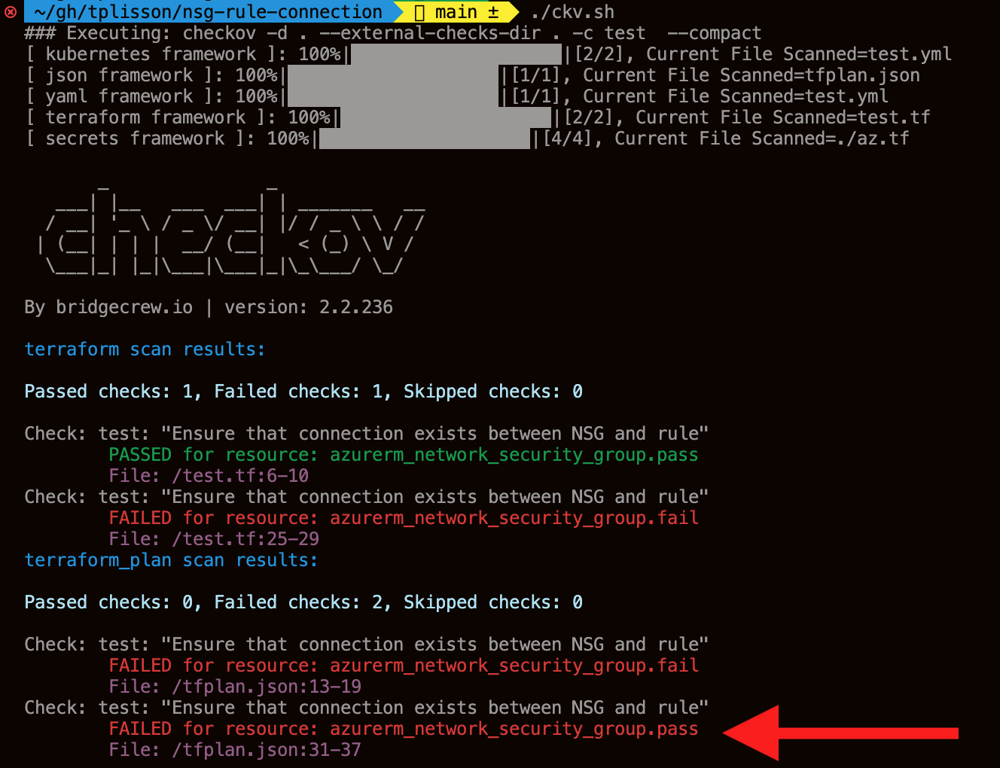

# nsg-rule-connection


```yaml
---
metadata:
  name: "Ensure that connection exists between NSG and rule"
  id: test
scope:
  provider: azure 
definition:
  and:
    - cond_type: connection
      resource_types:
      - azurerm_network_security_group
      connected_resource_types: 
      - azurerm_network_security_rule
      operator: exists
    - cond_type: filter
      attribute: resource_type
      value:
      - azurerm_network_security_group
      operator: within
```


Reference-style: 


